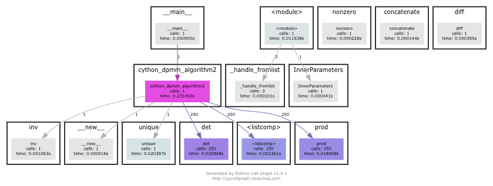
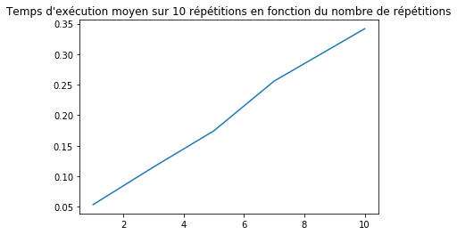

# Elements logiciels  pour le traitement des données massives

<b> Projet de fin de semestre - année universitaire 2019-2020 

Hugo Thimonier, Gabriel Kasmi - 3A DS-SA </b>

# 4. Performances de l'algorithme parallélisé

Nous analysons finalement l'algorithme parallélisé. La principale difficulté pour paralléliser un tel algorithme vient du fait qu'il est séquentiel. Notre démarche a donc consisté à voir dans l'algorithme quelles étaient les étapes qui n'étaient pas séquentielles et à nous focaliser sur ces dernières pour pouvoir mener à bien notre parallélisation. Il se trouve que le calcul de la table de probabilité d'appartenance d'une observation à un cluster ne requiert pas la connaissance de l'étape antérieure (pour une observation et une itération données). Ainsi, après avoir optimisé ces fonctions en C, nous les avons parallélisé la boucle qui calcule la probabilité d'appartenance à chacun des clusters.


```python
from jyquickhelper import add_notebook_menu
add_notebook_menu()
```


<div id="my_id_menu_nb">run previous cell, wait for 2 seconds</div>
<script>
function repeat_indent_string(n){
    var a = "" ;
    for ( ; n > 0 ; --n)
        a += "    ";
    return a;
}
// look up into all sections and builds an automated menu //
var update_menu_string = function(begin, lfirst, llast, sformat, send, keep_item, begin_format, end_format) {
    var anchors = document.getElementsByClassName("section");
    if (anchors.length == 0) {
        anchors = document.getElementsByClassName("text_cell_render rendered_html");
    }
    var i,t;
    var text_menu = begin;
    var text_memo = "<pre>\nlength:" + anchors.length + "\n";
    var ind = "";
    var memo_level = 1;
    var href;
    var tags = [];
    var main_item = 0;
    var format_open = 0;
    for (i = 0; i <= llast; i++)
        tags.push("h" + i);

    for (i = 0; i < anchors.length; i++) {
        text_memo += "**" + anchors[i].id + "--\n";

        var child = null;
        for(t = 0; t < tags.length; t++) {
            var r = anchors[i].getElementsByTagName(tags[t]);
            if (r.length > 0) {
child = r[0];
break;
            }
        }
        if (child == null) {
            text_memo += "null\n";
            continue;
        }
        if (anchors[i].hasAttribute("id")) {
            // when converted in RST
            href = anchors[i].id;
            text_memo += "#1-" + href;
            // passer à child suivant (le chercher)
        }
        else if (child.hasAttribute("id")) {
            // in a notebook
            href = child.id;
            text_memo += "#2-" + href;
        }
        else {
            text_memo += "#3-" + "*" + "\n";
            continue;
        }
        var title = child.textContent;
        var level = parseInt(child.tagName.substring(1,2));

        text_memo += "--" + level + "?" + lfirst + "--" + title + "\n";

        if ((level < lfirst) || (level > llast)) {
            continue ;
        }
        if (title.endsWith('¶')) {
            title = title.substring(0,title.length-1).replace("<", "&lt;")
         .replace(">", "&gt;").replace("&", "&amp;");
        }
        if (title.length == 0) {
            continue;
        }

        while (level < memo_level) {
            text_menu += end_format + "</ul>\n";
            format_open -= 1;
            memo_level -= 1;
        }
        if (level == lfirst) {
            main_item += 1;
        }
        if (keep_item != -1 && main_item != keep_item + 1) {
            // alert(main_item + " - " + level + " - " + keep_item);
            continue;
        }
        while (level > memo_level) {
            text_menu += "<ul>\n";
            memo_level += 1;
        }
        text_menu += repeat_indent_string(level-2);
        text_menu += begin_format + sformat.replace("__HREF__", href).replace("__TITLE__", title);
        format_open += 1;
    }
    while (1 < memo_level) {
        text_menu += end_format + "</ul>\n";
        memo_level -= 1;
        format_open -= 1;
    }
    text_menu += send;
    //text_menu += "\n" + text_memo;

    while (format_open > 0) {
        text_menu += end_format;
        format_open -= 1;
    }
    return text_menu;
};
var update_menu = function() {
    var sbegin = "";
    var sformat = '<a href="#__HREF__">__TITLE__</a>';
    var send = "";
    var begin_format = '<li>';
    var end_format = '</li>';
    var keep_item = -1;
    var text_menu = update_menu_string(sbegin, 2, 4, sformat, send, keep_item,
       begin_format, end_format);
    var menu = document.getElementById("my_id_menu_nb");
    menu.innerHTML=text_menu;
};
window.setTimeout(update_menu,2000);
            </script>


```python
%run '../Fonction_et_utilities/dpmm_optimized_cython_parallel.py'
```


```python
import collections

# Fichiers auxiliaires, utilitaires et paramètres
# %run 'utilities.py'

# Distribution a priori des centroïdes des clusters :
mu_0 = np.array([0, 0]) # Espérance de la loi normale pour mu.
Sigma_0 = 32 * np.eye(2) # Variance (échelle) de la loi normale pour mu.

# Distribution a priori des variances des clusters : 
nu = 9.0 # Nombre de degrés de liberté de la loi inv-Wishart.
sigma_0 =  1. # "Variance" (échelle) pour la loi inv-Wishart.

# Paramètres complémentaires pour l'inférence.
alpha = 0.03 # Paramètre d'échelle pour le processus de Dirichelet.
sigma_x = 0.5 # Bruit sur les observations.

# Nombre d'itérations pour l'algorithme de Gibbs :
n_iter = 1


# Importation du CSV des observations simulées

raw_input = pd.read_csv('../data/simulated_observations.csv')
data = raw_input[["x_coordinate",'y_coordinate']]

# Pour l'assignation des clusters, on a le choix. On commence avec une assignation 
# initiale dans un même cluster. 
c_pooled = np.ones(data.shape[0])

data.head()

```


<div>
<style scoped>
    .dataframe tbody tr th:only-of-type {
        vertical-align: middle;
    }

    .dataframe tbody tr th {
        vertical-align: top;
    }

    .dataframe thead th {
        text-align: right;
    }
</style>
<table border="1" class="dataframe">
  <thead>
    <tr style="text-align: right;">
      <th></th>
      <th>x_coordinate</th>
      <th>y_coordinate</th>
    </tr>
  </thead>
  <tbody>
    <tr>
      <th>0</th>
      <td>-2.934991</td>
      <td>-7.007746</td>
    </tr>
    <tr>
      <th>1</th>
      <td>6.356237</td>
      <td>0.884789</td>
    </tr>
    <tr>
      <th>2</th>
      <td>-7.083561</td>
      <td>3.303427</td>
    </tr>
    <tr>
      <th>3</th>
      <td>-3.678442</td>
      <td>-7.383803</td>
    </tr>
    <tr>
      <th>4</th>
      <td>-2.803186</td>
      <td>-1.294134</td>
    </tr>
  </tbody>
</table>
</div>


### Premiers chronométrages


```python
# Essai sur une observation

cython_dpmm_algorithm2(data, alpha, mu_0, Sigma_0, sigma_x, n_iter, c_pooled, savetime = True, traceback = False)[1]
```


    0.0655660629272461


```python
# Moyenne sur 100 exécutions

times = []
for i in range(100):
    times.append(cython_dpmm_algorithm2(data, alpha, mu_0, Sigma_0, sigma_x, n_iter, c_pooled, savetime = True, traceback = False)[1])
np.mean(times) 
```


    0.03821620941162109


### Recensement et affichage des threads


```python
# Recensement des threads

import cProfile

pr = cProfile.Profile()
pr.enable()
 
cython_dpmm_algorithm2(data, alpha, mu_0, Sigma_0, sigma_x, n_iter, c_pooled, savetime = True, traceback = False)
 
pr.disable()
 
pr.print_stats(sort='time')
```

             17062 function calls (17056 primitive calls) in 0.060 seconds
    
       Ordered by: internal time
    
       ncalls  tottime  percall  cumtime  percall filename:lineno(function)
          250    0.013    0.000    0.021    0.000 {method 'choice' of 'numpy.random.mtrand.RandomState' objects}
            1    0.010    0.010    0.059    0.059 dpmm_optimized_cython_parallel.py:410(cython_dpmm_algorithm2)
          250    0.007    0.000    0.015    0.000 {built-in method dpmm_cython_functions.c_compute_log_probability_not_cluster}
          500    0.004    0.000    0.004    0.000 {method 'reduce' of 'numpy.ufunc' objects}
          250    0.003    0.000    0.007    0.000 linalg.py:2072(det)
         1504    0.003    0.000    0.003    0.000 {built-in method numpy.array}
          250    0.003    0.000    0.003    0.000 {built-in method dpmm_cython_functions.c_convert_into_probabilities}
         1001    0.002    0.000    0.002    0.000 {built-in method numpy.empty}
          500    0.001    0.000    0.001    0.000 {method 'astype' of 'numpy.generic' objects}
          250    0.001    0.000    0.001    0.000 dpmm_optimized_cython_parallel.py:563(<listcomp>)
          250    0.001    0.000    0.004    0.000 fromnumeric.py:73(_wrapreduction)
      505/502    0.001    0.000    0.012    0.000 {built-in method numpy.core._multiarray_umath.implement_array_function}
          251    0.001    0.000    0.001    0.000 linalg.py:144(_commonType)
          500    0.001    0.000    0.001    0.000 getlimits.py:365(__new__)
         1503    0.001    0.000    0.001    0.000 {built-in method builtins.issubclass}
          250    0.001    0.000    0.004    0.000 fromnumeric.py:2792(prod)
         1251    0.001    0.000    0.003    0.000 _asarray.py:16(asarray)
          250    0.001    0.000    0.001    0.000 numerictypes.py:365(issubdtype)
          500    0.001    0.000    0.001    0.000 numerictypes.py:293(issubclass_)
          3/2    0.000    0.000    0.059    0.030 {built-in method builtins.exec}
          250    0.000    0.000    0.005    0.000 <__array_function__ internals>:2(prod)
          250    0.000    0.000    0.008    0.000 <__array_function__ internals>:2(det)
          250    0.000    0.000    0.002    0.000 {method 'sum' of 'numpy.ndarray' objects}
          252    0.000    0.000    0.000    0.000 {built-in method builtins.getattr}
          250    0.000    0.000    0.000    0.000 fromnumeric.py:74(<dictcomp>)
          251    0.000    0.000    0.000    0.000 linalg.py:209(_assertNdSquareness)
          251    0.000    0.000    0.000    0.000 linalg.py:203(_assertRankAtLeast2)
          752    0.000    0.000    0.000    0.000 {method 'get' of 'dict' objects}
          502    0.000    0.000    0.000    0.000 linalg.py:121(isComplexType)
    1012/1010    0.000    0.000    0.000    0.000 {built-in method builtins.len}
          251    0.000    0.000    0.000    0.000 linalg.py:134(_realType)
          750    0.000    0.000    0.000    0.000 {method 'items' of 'dict' objects}
          250    0.000    0.000    0.002    0.000 _methods.py:36(_sum)
          627    0.000    0.000    0.000    0.000 {built-in method math.isnan}
            1    0.000    0.000    0.000    0.000 {method 'sort' of 'numpy.ndarray' objects}
          501    0.000    0.000    0.000    0.000 {method 'keys' of 'dict' objects}
          251    0.000    0.000    0.000    0.000 linalg.py:482(_unary_dispatcher)
            1    0.000    0.000    0.000    0.000 linalg.py:486(inv)
          250    0.000    0.000    0.000    0.000 fromnumeric.py:2787(_prod_dispatcher)
            2    0.000    0.000    0.000    0.000 {built-in method builtins.compile}
            1    0.000    0.000    0.001    0.001 __init__.py:357(namedtuple)
            1    0.000    0.000    0.000    0.000 arraysetops.py:297(_unique1d)
            1    0.000    0.000    0.000    0.000 {built-in method builtins.__build_class__}
           13    0.000    0.000    0.000    0.000 {method 'format' of 'str' objects}
            2    0.000    0.000    0.059    0.030 interactiveshell.py:2832(run_code)
            1    0.000    0.000    0.000    0.000 function_base.py:1147(diff)
            2    0.000    0.000    0.000    0.000 twodim_base.py:154(eye)
            2    0.000    0.000    0.000    0.000 {method 'astype' of 'numpy.ndarray' objects}
            1    0.000    0.000    0.000    0.000 <ipython-input-14-96a4cc5d03ef>:10(<module>)
            1    0.000    0.000    0.000    0.000 <string>:5(InnerParameters)
            2    0.000    0.000    0.000    0.000 codeop.py:132(__call__)
            1    0.000    0.000    0.000    0.000 <string>:1(<module>)
            1    0.000    0.000    0.059    0.059 <ipython-input-14-96a4cc5d03ef>:8(<module>)
            1    0.000    0.000    0.000    0.000 {method 'flatten' of 'numpy.ndarray' objects}
            2    0.000    0.000    0.000    0.000 {built-in method numpy.zeros}
            1    0.000    0.000    0.000    0.000 internals.py:3351(_is_single_block)
            2    0.000    0.000    0.000    0.000 {method 'join' of 'str' objects}
            4    0.000    0.000    0.000    0.000 {built-in method builtins.hasattr}
            1    0.000    0.000    0.000    0.000 <string>:12(__new__)
            7    0.000    0.000    0.000    0.000 __init__.py:420(<genexpr>)
            1    0.000    0.000    0.000    0.000 arraysetops.py:151(unique)
            1    0.000    0.000    0.000    0.000 generic.py:4423(_protect_consolidate)
            2    0.000    0.000    0.000    0.000 hooks.py:142(__call__)
            1    0.000    0.000    0.000    0.000 {method 'transpose' of 'numpy.ndarray' objects}
            1    0.000    0.000    0.000    0.000 linalg.py:116(_makearray)
            1    0.000    0.000    0.000    0.000 <__array_function__ internals>:2(inv)
            1    0.000    0.000    0.000    0.000 internals.py:3922(as_array)
            7    0.000    0.000    0.000    0.000 {method 'isidentifier' of 'str' objects}
            1    0.000    0.000    0.000    0.000 {built-in method builtins.repr}
            3    0.000    0.000    0.000    0.000 <frozen importlib._bootstrap>:997(_handle_fromlist)
            7    0.000    0.000    0.000    0.000 __init__.py:422(<genexpr>)
            2    0.000    0.000    0.000    0.000 ipstruct.py:125(__getattr__)
            1    0.000    0.000    0.000    0.000 fromnumeric.py:55(_wrapfunc)
            1    0.000    0.000    0.000    0.000 <__array_function__ internals>:2(nonzero)
            1    0.000    0.000    0.000    0.000 <__array_function__ internals>:2(unique)
            1    0.000    0.000    0.000    0.000 generic.py:4378(__setattr__)
            1    0.000    0.000    0.000    0.000 generic.py:4436(f)
            1    0.000    0.000    0.000    0.000 generic.py:4563(values)
            1    0.000    0.000    0.000    0.000 {method 'replace' of 'str' objects}
            6    0.000    0.000    0.000    0.000 {method 'startswith' of 'str' objects}
            1    0.000    0.000    0.000    0.000 fromnumeric.py:1759(nonzero)
            1    0.000    0.000    0.000    0.000 <__array_function__ internals>:2(concatenate)
            1    0.000    0.000    0.000    0.000 {method 'nonzero' of 'numpy.ndarray' objects}
            1    0.000    0.000    0.000    0.000 linalg.py:111(get_linalg_error_extobj)
            1    0.000    0.000    0.000    0.000 generic.py:4433(_consolidate_inplace)
            1    0.000    0.000    0.000    0.000 {built-in method __new__ of type object at 0x10d89ddd8}
            2    0.000    0.000    0.000    0.000 {built-in method builtins.isinstance}
            1    0.000    0.000    0.000    0.000 {built-in method sys._getframe}
            2    0.000    0.000    0.000    0.000 interactiveshell.py:1055(user_global_ns)
            1    0.000    0.000    0.000    0.000 {method 'disable' of '_lsprof.Profiler' objects}
            1    0.000    0.000    0.000    0.000 multiarray.py:145(concatenate)
            3    0.000    0.000    0.000    0.000 _asarray.py:88(asanyarray)
            1    0.000    0.000    0.000    0.000 {built-in method numpy.core._multiarray_umath.normalize_axis_index}
            1    0.000    0.000    0.000    0.000 function_base.py:1143(_diff_dispatcher)
            1    0.000    0.000    0.000    0.000 <__array_function__ internals>:2(diff)
            1    0.000    0.000    0.000    0.000 arraysetops.py:138(_unpack_tuple)
            1    0.000    0.000    0.000    0.000 common.py:89(is_object_dtype)
            1    0.000    0.000    0.000    0.000 base.py:641(__len__)
            1    0.000    0.000    0.000    0.000 internals.py:3311(ndim)
            1    0.000    0.000    0.000    0.000 internals.py:3473(__len__)
            1    0.000    0.000    0.000    0.000 internals.py:3776(is_consolidated)
            1    0.000    0.000    0.000    0.000 internals.py:4085(consolidate)
            1    0.000    0.000    0.000    0.000 internals.py:213(get_values)
            2    0.000    0.000    0.000    0.000 internals.py:233(mgr_locs)
            1    0.000    0.000    0.000    0.000 {method 'append' of 'list' objects}
            6    0.000    0.000    0.000    0.000 {method 'add' of 'set' objects}
            7    0.000    0.000    0.000    0.000 {method '__contains__' of 'frozenset' objects}
            2    0.000    0.000    0.000    0.000 {built-in method time.time}
            2    0.000    0.000    0.000    0.000 hooks.py:207(pre_run_code_hook)
            1    0.000    0.000    0.000    0.000 fromnumeric.py:1755(_nonzero_dispatcher)
            1    0.000    0.000    0.000    0.000 {method '__array_prepare__' of 'numpy.ndarray' objects}
            1    0.000    0.000    0.000    0.000 arraysetops.py:146(_unique_dispatcher)
            1    0.000    0.000    0.000    0.000 internals.py:3384(_get_items)
    
    


```python
# Affichage des threads sous forme de graphe

from pycallgraph import PyCallGraph
from pycallgraph.output import GraphvizOutput

graphviz = GraphvizOutput()
graphviz.output_file = '../figures/threads_parallelized_algorithm.png'

with PyCallGraph(output=graphviz, config=None):
    cython_dpmm_algorithm2(data, alpha, mu_0, Sigma_0, sigma_x, n_iter, c_pooled, savetime = True, traceback = False)
    
    
from IPython.display import Image
Image(filename='../figures/threads_parallelized_algorithm.png')     
```





### Performances en fonction du nombre d'itérations


```python
import numpy as np
from progressbar import ProgressBar

pbar = ProgressBar()

values = np.linspace(1,10,5, dtype = int)
times = []
n_reps = 10
for j in pbar(values):
    times_intermediate = []
    for i in range(n_reps):
        times_intermediate.append(cython_dpmm_algorithm2(data, alpha, mu_0, Sigma_0, sigma_x, j, c_pooled, savetime = True, traceback = False)[1])
    times.append(np.mean(times_intermediate)) 
```

    100% |########################################################################|


```python
import matplotlib.pyplot as plt

plt.plot(values, times)
plt.title("Temps d'exécution moyen sur 10 répétitions en fonction du nombre de répétitions")
plt.show()
```





### Performances en fonction du nombre d'observations


```python
# Charger les données avec 500 et 1000 observations

raw_2 = pd.read_csv('../data/simulated_observations_500.csv')
data_500 = raw_2[["x_coordinate",'y_coordinate']]

raw_3 = pd.read_csv('../data/simulated_observations_1000.csv')
data_1000 = raw_3[["x_coordinate",'y_coordinate']]

# Liste avec les trois données 

observations = {250 : data,
               500 : data_500,
               1000 : data_1000}

# Nombre d'observations et calcul du temps d'éxecution avec 10 itérations à chaque pas

times_obs = []

n_reps, n_iter = 10, 10
for d in observations.keys():
    data_shape = observations[d].shape[0]
    c_init = np.ones(data_shape)
    times_intermediate = []
    data_to_test = observations[d]
    for i in range(n_reps):
        times_intermediate.append(cython_dpmm_algorithm2(data_to_test, alpha, mu_0, Sigma_0, sigma_x, n_iter, c_init, savetime = True, traceback = False)[1])
    
    times_obs.append(np.mean(times_intermediate))


plt.plot(observations.keys(), times_obs)
plt.title("Temps d'exécution moyen sur 10 répétitions pour 10 itérations en fonction du nombre d'observations")
plt.show()        
```


